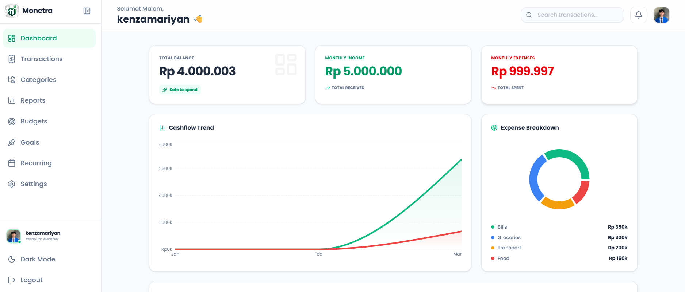
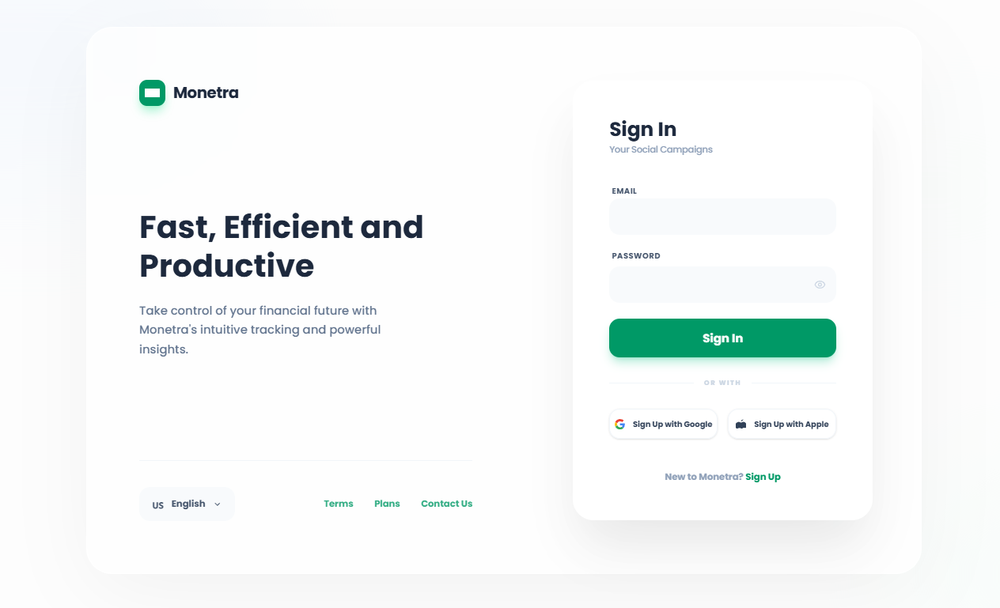
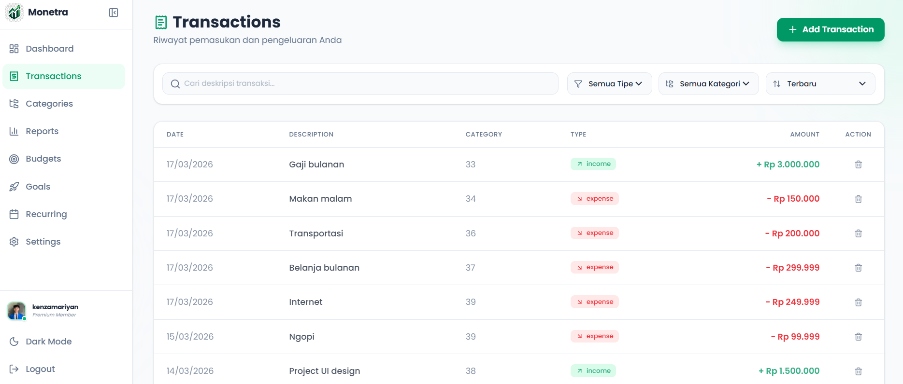
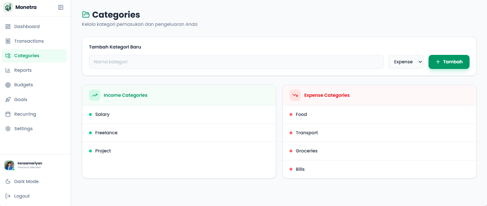
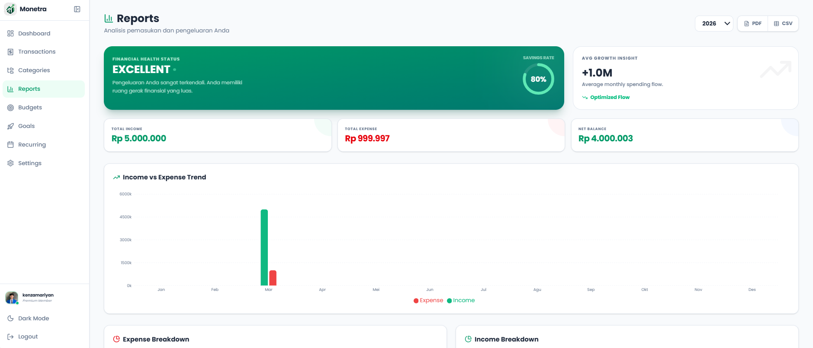
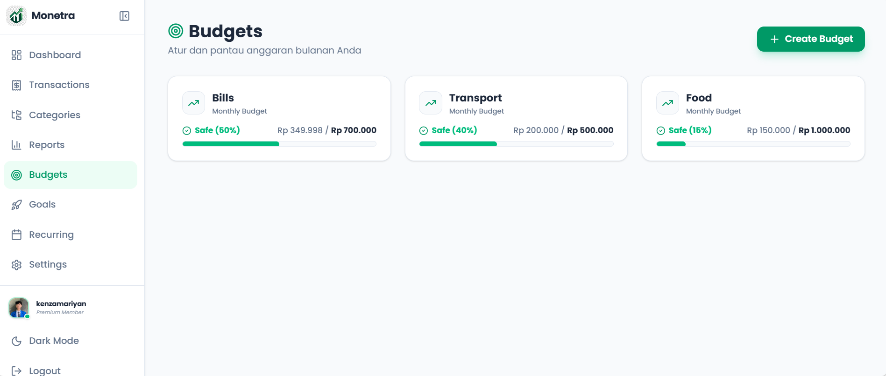

# Personal Finance Tracker



<p align="center">
  
  
  
  
  
  
</p>

A premium, modern web application to track your income, expenses, budgets, and savings goals. Built with a powerful Go backend and a sleek React frontend.

## ✨ Features
- **Dashboard**: High-level overview of your cashflow and spending trends.
- **Transaction Management**: Easily add and track incomes and expenses.
- **Recurring Transactions**: Automate your monthly bills or salary.
- **Budgeting**: Set limits for different categories and get notified before you overspend.
- **Goals**: Save for what matters to you with specialized goal tracking.
- **AI-Powered Insights**: Get smart financial advice based on your spending habits.
- **Modern UI**: Fullscreen, premium design with dark mode and smooth animations.

## 🛠 Tech Stack
- **Frontend**: React, Vite, TailwindCSS, Lucide-React, Recharts.
- **Backend**: Go (Golang), Gin Framework, PGX.
- **Database**: PostgreSQL.
- **Auth**: JWT with Bcrypt password hashing.

## 🚀 Getting Started

### Prerequisites
- [Go](https://go.dev/dl/) (1.20+)
- [Node.js](https://nodejs.org/) (v18+)
- [PostgreSQL](https://www.postgresql.org/download/)

### 1. Database Setup
Create a new database in PostgreSQL named `finance_tracker`.
Run the schema migration:
```bash
psql -U postgres -d finance_tracker -f backend/migrations/001_schema.sql
```

### 2. Backend Configuration
Navigate to the `backend` folder and create a `.env` file:
```env
DB_HOST=localhost
DB_PORT=5432
DB_USER=your_user
DB_PASSWORD=your_password
DB_NAME=finance_tracker
JWT_SECRET=your_secret_key
ALLOWED_ORIGIN=http://localhost:5173
```
Install dependencies and run the server:
```bash
cd backend
go mod tidy
go run cmd/main.go
```

### 3. Frontend Configuration
Navigate to the `frontend` folder and create a `.env` file:
```env
VITE_API_URL=http://localhost:8080/api
```
Install dependencies and run the development server:
```bash
cd frontend
npm install
npm run dev
```

## 🔒 Security
This project uses:
- **Environment Variables**: Sensitive data is never hardcoded.
- **JWT**: Secure token-based authentication.
- **Bcrypt**: Industrial-strength password hashing.
- **CORS**: Restricted origins for API security.

## 📄 License
This project is licensed under the MIT License.
